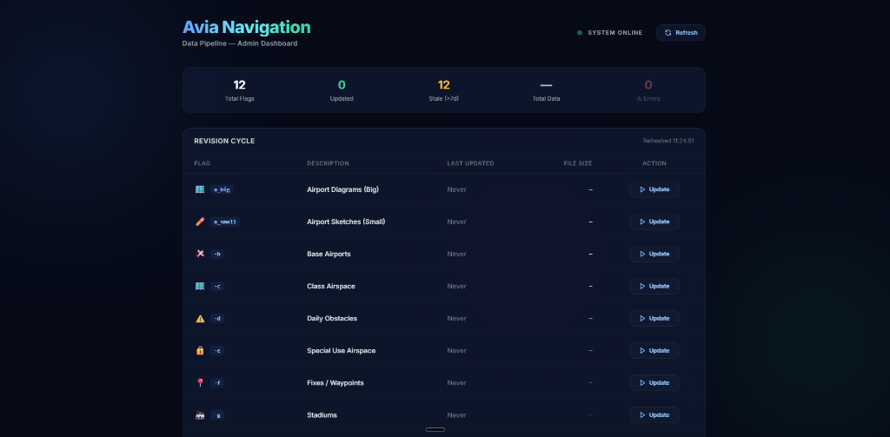

# ✈️ Avia Navigation Data Pipeline & Admin API

[](https://www.python.org/)
[](https://fastapi.tiangolo.com/)
[](https://www.docker.com/)
[](LICENSE)

A robust, enterprise-grade aviation data processing engine. This system automates the acquisition, parsing, and optimization of FAA aeronautical data, providing a high-performance API and a modern administrative dashboard.

<p align="center">
  
</p>

---

## ✨ Key Features

### 🛠️ Intelligent Data Scraper
- **Automated Lifecycle**: Periodically fetches and processes FAA 28-day NASR subscriptions.
- **Fail-Soft Architecture**: Each data flag (`-b`, `-f`, `-d`, etc.) runs in isolated try/except blocks.
- **Auto-Cleanup**: Intelligent disk management that preserves only the most recent datasets.
- **Validation**: Strict ZIP integrity checks to prevent data corruption.

### 🖥️ Glassmorphism Admin Dashboard
- **Modern UI**: Sleek, dark-mode administrative panel with real-time task tracking.
- **Monitoring**: Live updates on file sizes, last modification timestamps, and task execution states.
- **Remote Control**: Trigger specific data updates directly from the web interface.

### 🔔 Telegram Alerting System
- **Real-time Notifications**: Instant alerts for processing errors, corrupted files, or system connectivity issues.
- **Actionable Logs**: Direct links and error tracebacks sent straight to your dev group.

---

## 🚀 Technical Stack

- **Core**: Python 3.10+
- **API**: FastAPI (Asynchronous framework)
- **Data**: Pandas, GeoPandas (Spatial data optimization)
- **UI**: Tailwind CSS, Glassmorphism design system
- **DevOps**: Docker, Docker Compose

---

## 🛠️ Quick Start

### 1. Installation
```bash
# Clone the repository
git clone https://github.com/your-username/aviation-navigation-server.git
cd aviation-navigation-server

# Create and activate virtual environment
python3 -m venv venv
source venv/bin/activate  # On Windows: venv\Scripts\activate

# Install dependencies
pip install -r requirements.txt
```

### 2. Configuration
Create a `.env` file in the root directory based on `sample_env`:
```env
TELEGRAM_BOT_TOKEN=your_token_here
TELEGRAM_CHAT_ID=your_chat_id_here
AUTH_TOKEN=your_secure_admin_token
```

### 3. Execution
**Run the API:**
```bash
fastapi dev app/main.py
```
**Run the Scraper manually:**
```bash
python3 -m web_scraper.script -b # Update Base Airports
```

---

## 🐳 Docker Deployment

The project is fully containerized for seamless server deployment.

```bash
# Build and start the infrastructure
docker compose up -d --build

# View logs
docker compose logs -f
```

The production API will be available at `http://your-server-ip:5046`.

---

## 📐 Project Structure

```text
├── app/               # FastAPI application & Routers
│   └── routers/       # Admin Dashboard & API endpoints
├── web_scraper/       # Core scraping & processing logic
│   ├── scraper_utils.py
│   ├── script.py      # Entry point for data processing
│   └── zip_utils.py
├── data/              # Processed CSV results
├── downloaded_data/   # Temporary storage for archives
└── requirements.txt
```

---

## 🛡️ Security

The Admin Dashboard is protected via Bearer Token authentication. Ensure your `AUTH_TOKEN` in `.env` is a strong, unique string.

---

## 📝 License

Distributed under the MIT License. See `LICENSE` for more information.

---
<p align="center">
  Developed with ❤️ for the Avia Navigation Project
</p>
